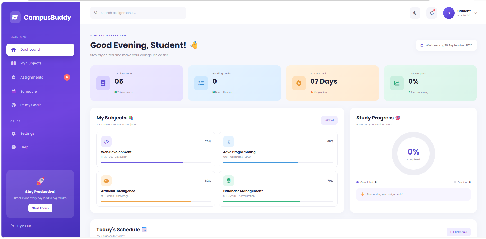
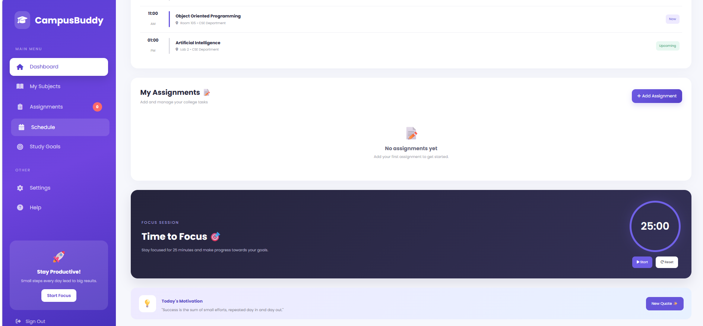

# CampusBuddy - Student Dashboard

CampusBuddy is a modern and responsive student dashboard designed to help students organize their academic activities in one place.

## Features

- 📚 Subject Progress Tracking
- 📝 Assignment Tracking
- 📅 Study Schedule
- 🎯 Study Goals
- 📊 Study Progress
- 🔔 Task and Notification Overview
- 🌙 Clean and Modern Dashboard UI

## Technologies Used

- HTML5
- CSS3
- JavaScript

## Project Structure

```text
CampusBuddy-Student-Dashboard/
│
├── index.html
├── style.css
└── script.js
```
## 📸 Project Screenshots

### Dashboard


### Features

